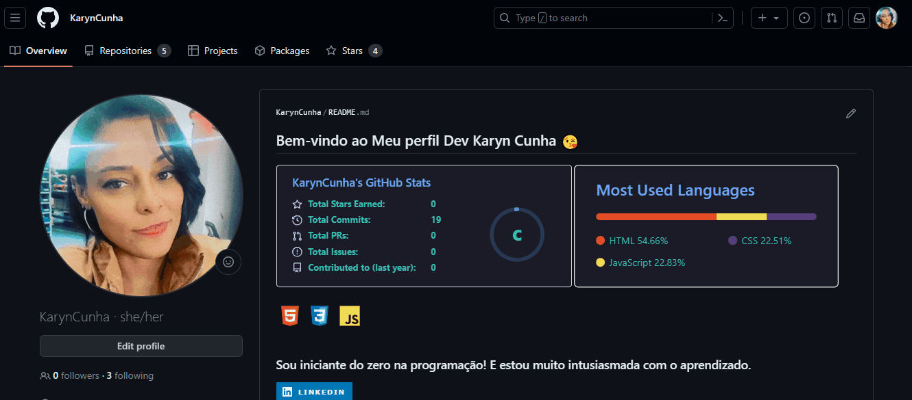

# Aula de como escrever um README
Nessa aula aprendi como criar um repositório no Github e clonar para o computador, e desenvolver o README no VSCode. Aprendi como criar um gif e a estrutura de como montar com seções bem elaboradas. 
Tudo descrito neste README é assunto da aula.

### Estou muito feliz por conseguir aprender e entender um pouco mais.💻

# Projeto com README
Um projeto de teste com arquivo de README ✔🐱‍💻

[]

## Tecnologias Utilizadas
- HMTL
- CSS
- JS

## Como utilizar

1- Clone o projeto
```
git clone
```

2- Acesse a pasta do projeto

```
cd repositorio-com-readme
```


